<div align="center">
  <h1>Course Registration System (CRS)</h1>
  
</div>


> **Streamline your institution's registration process with comprehensive solution**

## 📋 Overview

The Course Registration System (CRS) automates the academic registration process at educational institutions. This powerful platform enables students to efficiently manage their academic schedules while providing faculty and administrative staff with robust tools to maintain and track course and student data.

## ✨ Features

```
┌─────────────────────────────────────────────┐
│                                             │
│  ⚙️  User Management                        │
│     • Authentication & Authorization        │
│     • Role-based access control             │
│                                             │
│  📚 Course Management                       │
│     • Create, read, update, delete courses  │
│     • Manage prerequisites                  │
│                                             │
│  👥 Student Management                      │
│     • Comprehensive student records         │
│     • Profile management                    │
│                                             │
│  📝 Enrollment Services                     │
│     • Course registration                   │
│     • Automated Prerequisites Checking      │
│     • Enrollment history                    │
│     • Course withdrawal                     │
│                                             │
│  📊 Reporting Tools                         │
│     • Course enrollment Reports             │
│     • Student Academic Reports              │
│                                             │
└─────────────────────────────────────────────┘
```

## 🚀 Getting Started

### Prerequisites

- Java Development Kit (JDK) 21 or later
- JavaFX 11 or later
- MySQL database

### External Dependencies

- Java MySQL connector
- JavaFX libraries

### Installation

1. **Clone the repository**
   ```bash
   git clone https://github.com/Dettlaff404/Course-Registration-System-CRS-
   cd Course-Registration-System-CRS-
   ```

2. **Configure the database**
   ```bash
   # Create a new MySQL database using the provided SQL file
   mysql -u [username] -p [database_name] < crs_db_AshanManamperi.sql
   ```

3. **Launch the application**
   ```bash
   # Navigate to the source directory
   cd course_reg_system/src
   
   # Execute the main application file
   java App
   ```

## 🔧 Configuration

Adjust database connection settings in the configuration file before running the application.

## 📷 User Guide with Screenshots

***LogIn Portal***
<div align="center">
  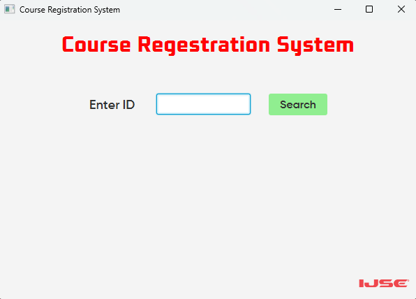
  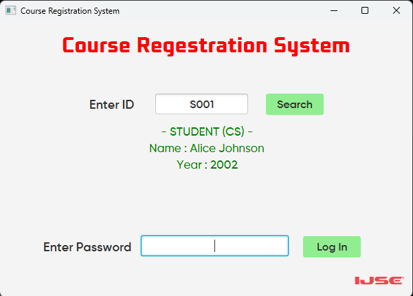
  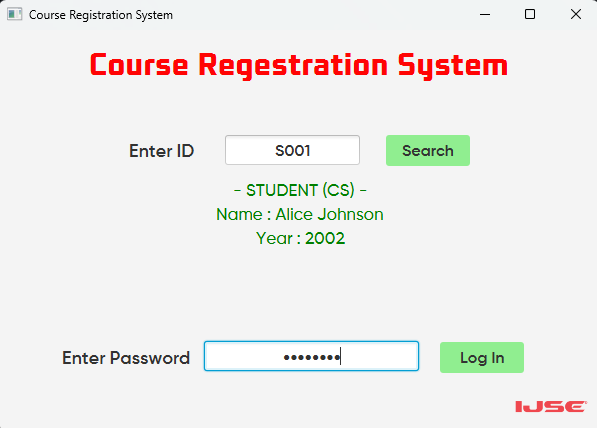
</div>

> ***LogIn portal allows users** (Admin which includes faculty and staff members and Students) **to effectively log in to there respective portals. If the user enters an invalid student id/ admin id or a password, relative error messages will be triggered.***

***Student Portal***
<div align="center">
  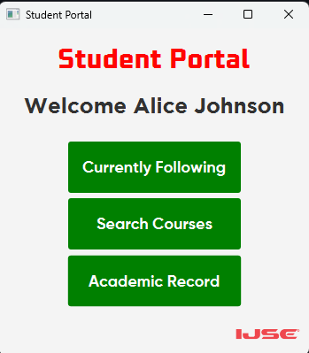
   <br>
  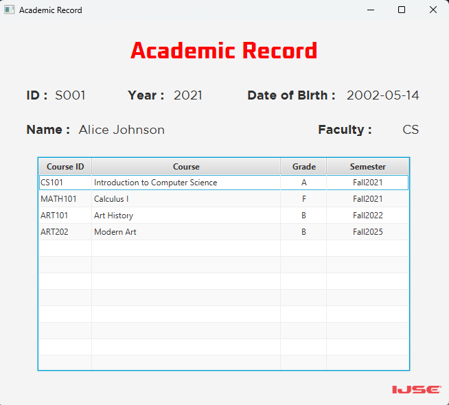
  <br>
  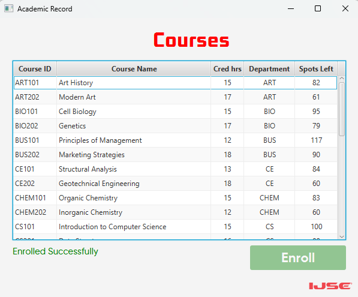
  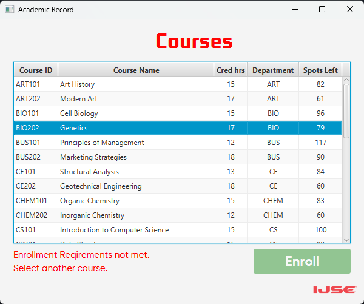
  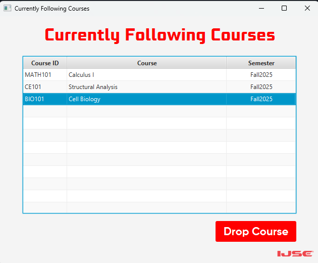
  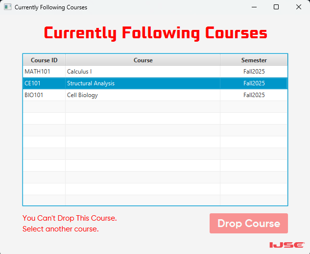
</div>

> ***Student Portal allows registered students in the system to access their Academic Report, Currently Following Courses** (where they can drop a selected course if its not passed 2 weeks after registering to the course) **and Courses Panel** (where they can enroll on new courses if they have completed the prerequisites for the course and it has enrollment spots left to be enrolled)*

***Admin Portal***
<div align="center">
  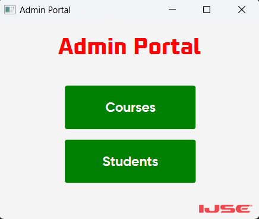
   <br>
  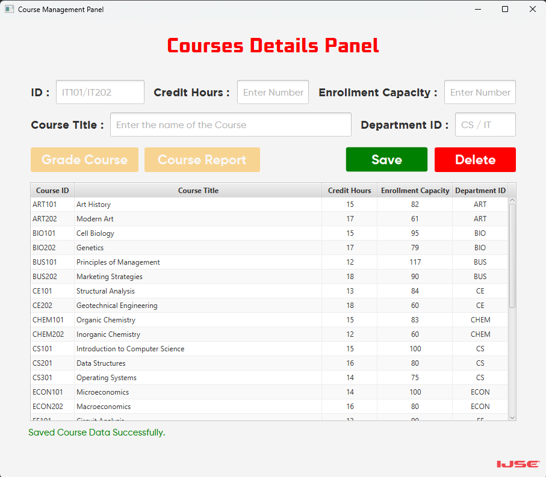
   <br>
  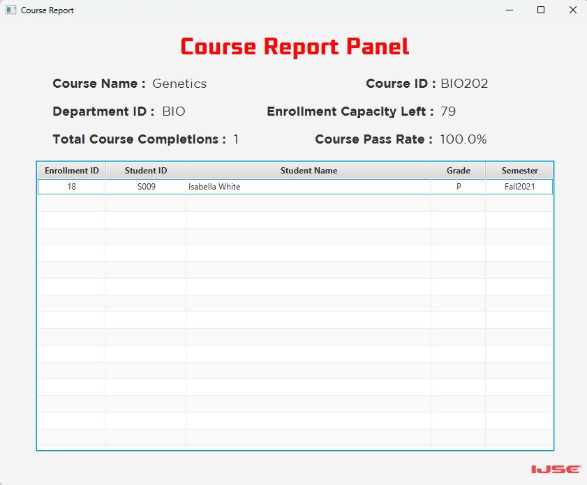
  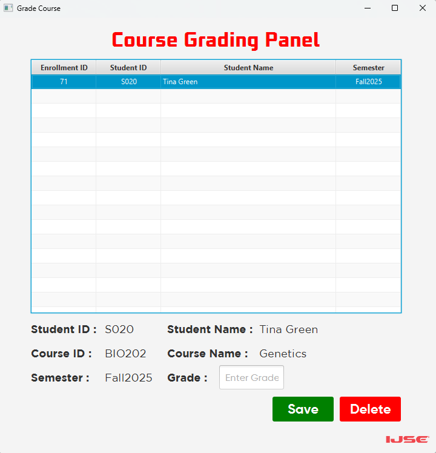
   <br>
  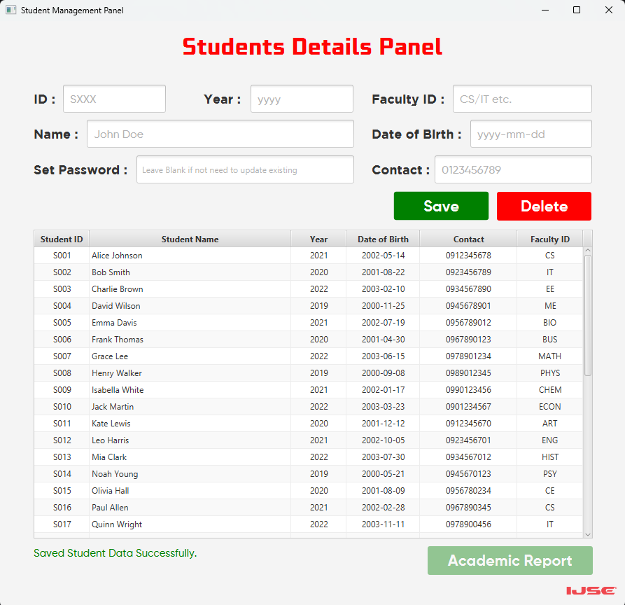
  
</div>

> ***Admin Portal consists of two panels Courses** (where admins can add a new course, update existing course data or delete a course. Moreover can get a report on courses which records all students data who have completed the course with pass rates. Additionally admins can access Grade Course Panel for each course here where they can use it to either grade students or delete there enrollment) **and Students Panel** (Where admins can add new students, update student data of existing students and get a Academic Report of students' course progressions).*


---

<p align="center">
  <i>Developed with ❤️ for educational institutions</i>
</p>
